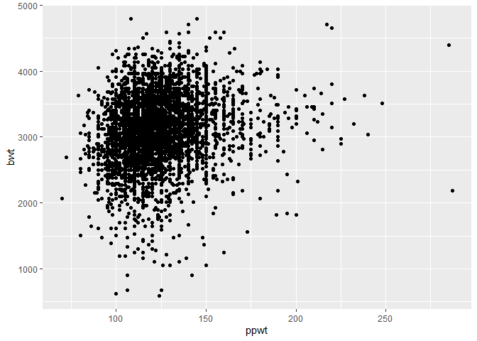
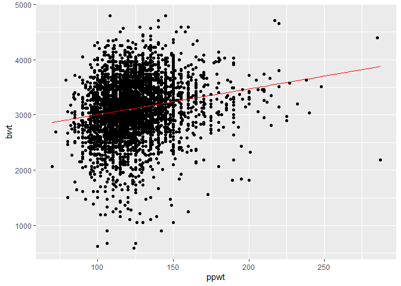
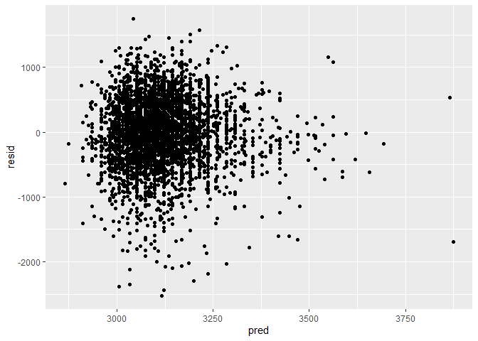
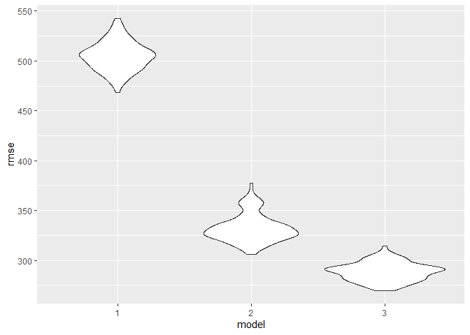
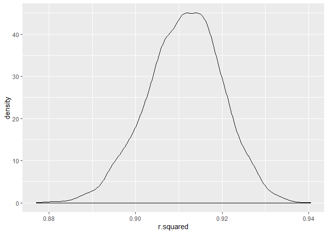
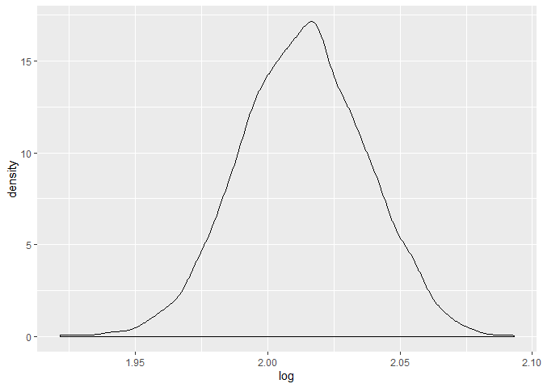

p8105\_hw6\_xl2934
================
Xiaoyang Li
2019/11/15

## Problem 1

### Load and clean the data for regression analysis .

``` r
children = read_csv("./data/birthweight.csv") 
```

    ## Parsed with column specification:
    ## cols(
    ##   .default = col_double()
    ## )

    ## See spec(...) for full column specifications.

``` r
sum(is.na(children))
```

    ## [1] 0

``` r
children = 
  children %>% 
  mutate(
    babysex = recode(babysex, "1" = "male", "2" = "female"),
    frace = recode(frace, "1" = "White", "2" = "Black", "3" = "Asian", "4" = "Puerto Rican", "8" = "Other", "9" = "Unknown"),
    mrace = recode(mrace, "1" = "White", "2" = "Black", "3" = "Asian", "4" = "Puerto Rican", "8" = "Other"),
    malform = recode(malform, "0" = "absent", "1" = "present"),
    babysex = factor(babysex),
    frace = factor(frace),
    mrace = factor(mrace),
    malform = factor(malform)
  )
```

### Propose a regression model for birthweight.

``` r
children %>% 
  ggplot(aes(x = ppwt, y = bwt)) +
  geom_point() 
```

<!-- -->

According to the plot above, I hypothesis that mother’s pre-pregnancy
weight can affect baby’s birth weight. Then I use `lm` to build linear
model for the relationship and make a plot for both crude data and
prediction from smooth model.

``` r
lm1 = lm(bwt ~ ppwt, data = children)

lm1 %>% 
  broom::tidy()
```

    ## # A tibble: 2 x 5
    ##   term        estimate std.error statistic  p.value
    ##   <chr>          <dbl>     <dbl>     <dbl>    <dbl>
    ## 1 (Intercept)  2541.      47.4        53.6 0.      
    ## 2 ppwt            4.65     0.379      12.3 5.69e-34

``` r
children %>% 
  add_predictions(lm1) %>% 
  select(bwt, ppwt, pred) %>% 
  ggplot(aes(x = ppwt, y = bwt)) +
  geom_point() +
  geom_line(aes(y = pred), color = "red")
```

<!-- -->

Here is the plot of model residuals against fitted values.

``` r
children %>% 
  add_predictions(lm1) %>% 
  add_residuals(lm1) %>% 
  ggplot(aes(x = pred, y = resid)) +
  geom_point()
```

<!-- -->

### Compare my model to two others

Build two other models

``` r
lm2 = lm(bwt ~ blength + gaweeks, data = children)
lm3 = lm(bwt ~ bhead + blength + babysex + bhead * blength + bhead * babysex + blength * babysex + bhead * blength * babysex, data = children)

lm2 %>% broom::tidy()
```

    ## # A tibble: 3 x 5
    ##   term        estimate std.error statistic  p.value
    ##   <chr>          <dbl>     <dbl>     <dbl>    <dbl>
    ## 1 (Intercept)  -4348.      98.0      -44.4 0.      
    ## 2 blength        129.       1.99      64.6 0.      
    ## 3 gaweeks         27.0      1.72      15.7 2.36e-54

``` r
lm3 %>% broom::tidy()
```

    ## # A tibble: 8 x 5
    ##   term                      estimate std.error statistic    p.value
    ##   <chr>                        <dbl>     <dbl>     <dbl>      <dbl>
    ## 1 (Intercept)                -802.    1102.       -0.728 0.467     
    ## 2 bhead                       -16.6     34.1      -0.487 0.626     
    ## 3 blength                     -21.6     23.4      -0.926 0.354     
    ## 4 babysexmale               -6375.    1678.       -3.80  0.000147  
    ## 5 bhead:blength                 3.32     0.713     4.67  0.00000317
    ## 6 bhead:babysexmale           198.      51.1       3.88  0.000105  
    ## 7 blength:babysexmale         124.      35.1       3.52  0.000429  
    ## 8 bhead:blength:babysexmale    -3.88     1.06     -3.67  0.000245

Make this comparison in terms of the cross-validated prediction error

``` r
cv_df = crossv_mc(children, 100)

cv_result = 
  cv_df %>% 
  mutate(
    lm1 = map(train, ~lm(bwt ~ ppwt, data = .x)),
    lm2 = map(train, ~lm(bwt ~ blength + gaweeks, data = .x)),
    lm3 = map(train, ~lm(bwt ~ bhead + blength + babysex + bhead * blength + bhead * babysex + blength * babysex + bhead * blength * babysex, data = .x))
  ) %>% 
  mutate(
    rmse1 = map2_dbl(lm1, test, ~rmse(model = .x, data = .y)),
    rmse2 = map2_dbl(lm2, test, ~rmse(model = .x, data = .y)),
    rmse3 = map2_dbl(lm3, test, ~rmse(model = .x, data = .y))
  )

cv_result %>% 
  select(contains("rmse")) %>% 
  pivot_longer(
    everything(),
    names_to = "model",
    names_prefix = "rmse",
    values_to = "rmse"
  ) %>% 
  mutate(model = fct_inorder(model)) %>% 
  ggplot(aes(x = model, y = rmse)) + geom_violin()
```

<!-- -->
According to the violin plot, RMSE of the model containing head
circumference, length, sex, and all interactions is smaller than other
two. Therefore, the model using using head circumference, length, sex,
and all interactions is the best one according to my comparison.

## Problem 2

Data import

``` r
weather_df = 
  rnoaa::meteo_pull_monitors(
    c("USW00094728"),
    var = c("PRCP", "TMIN", "TMAX"), 
    date_min = "2017-01-01",
    date_max = "2017-12-31") %>%
  mutate(
    name = recode(id, USW00094728 = "CentralPark_NY"),
    tmin = tmin / 10,
    tmax = tmax / 10) %>%
  select(name, id, everything())
```

    ## Registered S3 method overwritten by 'crul':
    ##   method                 from
    ##   as.character.form_file httr

    ## Registered S3 method overwritten by 'hoardr':
    ##   method           from
    ##   print.cache_info httr

    ## file path:          C:\Users\Xiaoyang Li\AppData\Local\rnoaa\rnoaa\Cache/ghcnd/USW00094728.dly

    ## file last updated:  2019-09-26 11:17:19

    ## file min/max dates: 1869-01-01 / 2019-09-30

``` r
weather_lm =
  weather_df %>% 
  select(tmax, tmin)
```

Bootstrap

``` r
boot_straps = 
  weather_lm %>% 
  bootstrap(n = 5000) %>% 
  mutate(
    models = map(strap, ~lm(tmax ~ tmin, data = .x)),
    glance = map(models, broom::glance),
    tidy = map(models, broom::tidy)
  ) 
```

Estimate about \(\hat r^2\)

``` r
r_square = 
  boot_straps %>% 
  select(glance) %>% 
  unnest(glance)

# distribution 
r_square %>% 
  ggplot(aes(x = r.squared)) + geom_density()
```

<!-- -->

``` r
# confidence interval
quantile(pull(r_square, r.squared), c(0.025,0.975))
```

    ##      2.5%     97.5% 
    ## 0.8936977 0.9274807

Except from the thin tail extending to low value, the distribution is
approximately a bell-shaped distrbution.

Estimate about \(log(\hat\beta_0 * \hat\beta_1 )\)

``` r
log_df = boot_straps %>% 
  unnest(tidy) %>% 
  select(.id, term, estimate) %>% 
  pivot_wider(
    names_from = term, 
    values_from = estimate
  ) %>% 
  rename(beta0 = `(Intercept)`,
         beta1 = tmin) %>% 
  mutate(
    log = log(beta0 * beta1)
  ) 

# distribution 
log_df %>% 
  ggplot(aes(x = log)) + geom_density()
```

<!-- -->

``` r
# confidence interval
quantile(pull(log_df, log), c(0.025,0.975))
```

    ##     2.5%    97.5% 
    ## 1.966942 2.058528

The distribution have asymmetric tail and peak.
